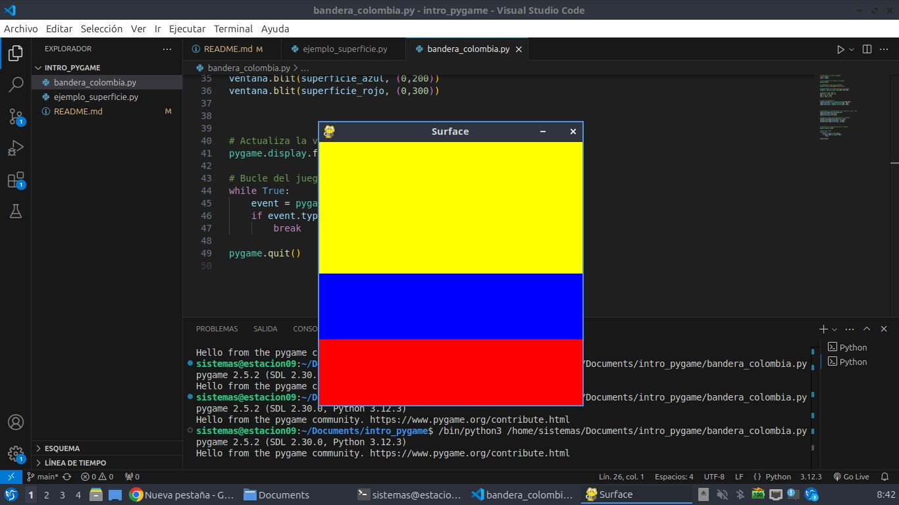

# Estructura de un juego en Pygame 

## Inicializaciòn

- Como en todo programa en Python, se debe importar los mòdulos o librerìas a utilizar
`import pygame`

- Inicializar Pygame usando a funciòn init(). Inicializa todos los mòdulos importados.
`pygame.init()`

## Visualizaciòn de la ventana

`ventana = pygame.display.set_mode((600,400))`

- set mode() es la funciòn de definir el tamaño de la ventana. En el ejemplo, se està definiendo una ventana de 600 px de ancho, por 400 px de alto.

`pygame.display.set_caption("Mi ventana")`

- set caption() es la funciòn que añade un tìtulo a la ventana.

### Funciòn set_mode()

`set_mode(size =(0,0), flags = 0, depth = 0, display = 0)`

- size = (600,400) : define el tamaño de la ventana.

- flags = define uno o màs comportamientos para la ventana.
    - Valores:
        - pygame.FULLSCREEN
        - pygame.RESIZABLE
    - Ejemplo:
        - flags = pygame.FUllSCREEN | pygame.RESIZABLE: pantalla completa, dimensiones modificables.

## Bucle del juego - game loop
- Bucle infinito que se interrumpirà al cumplir ciertos criterios.
- Reloj interno del juego
- En cada iteraciòn del bucle del juego podemos mover a un personaje, o tener en cuenta que un objeto ha alcanzado a otro o que se ha cruzado la lìnea de llegada, lo que quiere decir que la partida ha terminado.
- Cada iteraciòn es una oportunidad para actualizar todos los datos relacionados con el estado actual de la partida.
- En cada iteraciòn se realiza las siguientes tareas:
    1. Comprobar que no se alcanzan las condiciones de parada, en cuyo caso se interrumpe el bucle.
    2. Actualizar los recursos necesarios para la iteraciòn actual.
    3. Obtener las entradas del sistema, o de interacciòn con el jugador.
    4. Actualizar todas las entidades que caracterizan el juego.
    5. Refrescar la pantalla.

## Superficies pygame
- Superficie: 
    - Elemento geomètrico.
    - Lìnea, polìgono, imàgen, texto que se muestra en la pantalla.
    - El polìgono se puede o no rellenar de color.
    - Las superficies se crean de diferente manera dependiendo del tipo:
        - imagen: image.load()
        - texto: font.render()
        - Superficie genèrica: pygame.Surface()
        - Ventana del juego: pygamen.display.set_mode()

# Ejemplo: Bandera de Colombia

```python
# importamos la librerìa pygame
import pygame
import random 

# inicializamos los mòdulos de pygame
pygame.init()

#  Establecer tìtulo a la ventana
pygame.display.set_caption("Surface")

# Establecemos las dimensiones de la ventana
ventana = pygame.display.set_mode((400,400))

# Colores de la bandera
amarillo = (255, 255, 0)
azul = (0, 0, 255)
rojo = (255, 0, 0)


# crear una superficie
superficie_amarillo = pygame.Surface((400,200))
superficie_azul = pygame.Surface((400, 100))
superficie_rojo = pygame.Surface((400, 100))


# Rellenamos la superficie de color amarillo, azul, rojo
superficie_amarillo.fill(amarillo)
superficie_azul.fill(azul)
superficie_rojo.fill(rojo)

# Inserto o muevo la superficie de la ventana 
ventana.blit(superficie_amarillo, (0,0))
ventana.blit(superficie_azul, (0,200))
ventana.blit(superficie_rojo, (0,300))


# Actualiza la visualizaciòn de la ventana 
pygame.display.flip()

# Bucle del juego
while True:
    event = pygame.event.wait()
    if event.type == pygame.QUIT:
        break

pygame.quit() ```

```
```